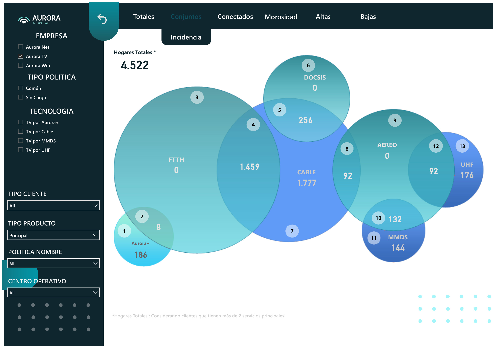
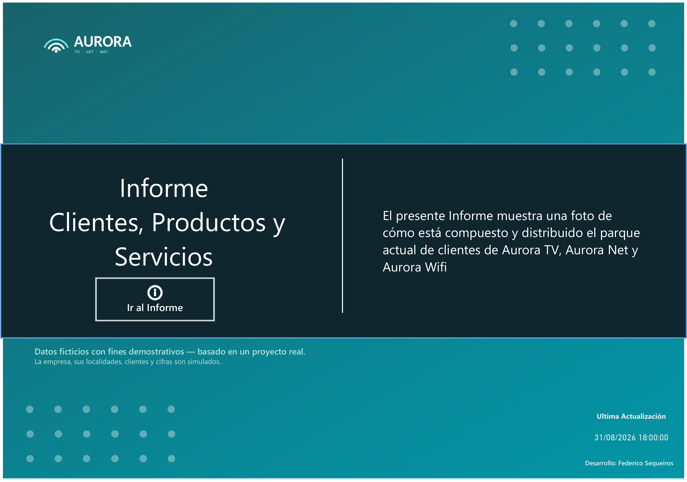
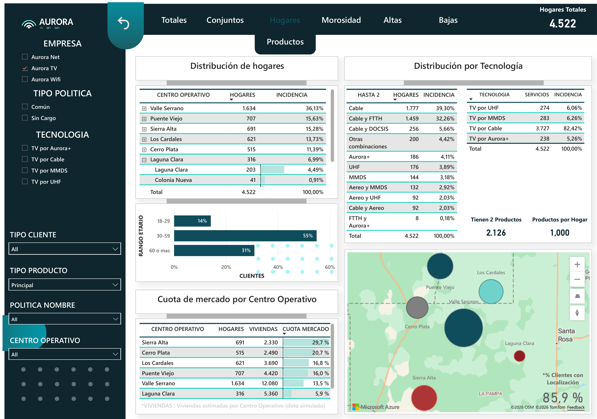
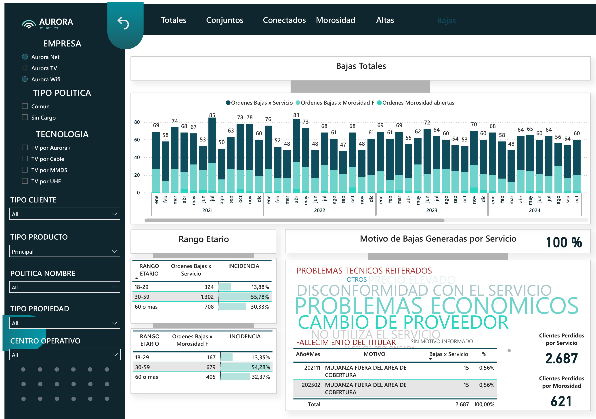

# Aurora — Customer, Product & Service Analytics (Power BI)

> The first Power BI report of a regional cable TV & internet provider. It replaced disconnected SQL + Excel extracts with a single view of the customer base: technologies, growth, location, delinquency, activations and churn.

> ⚠️ **Data note:** all data is synthetic. The company, locations, customers and figures are simulated; the report structure and logic reproduce a real project. Report language: Spanish.

## The problem
Before this report the company had no BI reporting. Customer counts, technologies, activations, disconnections and locations were pulled with separate SQL queries (through Toad) and pasted into Excel, where each area built its own reports. Combining those extracts was complex and slow: the time spent was never measured, and most of the time the information could not be cross-referenced at all.

## The solution
I joined the company to build its BI area with Power BI, and this was the first report. It started with one question from management — *how many customers do we have, and with which technologies?* — and grew page by page as each department added its needs.

| Page | Question it answers | Main users |
|---|---|---|
| **Conjuntos** (Bundles) | How many households have TV only, internet only or both, with which technology (FTTH, DOCSIS, aerial, cable, Aurora+, MMDS, UHF), and what share of the base does each combination represent? | Management |
| **Totales** (Trends) | How is each technology growing or shrinking month by month? Are there seasonal patterns? What share of customers remains on legacy technologies? | Management, technical |
| **Hogares** (Households) | Where are customers located, what is their age range and what is our market share by operating center? | Marketing, technical |
| **Productos** (Products)] | How many contracts do we have depending on the location, which tecnology | Management, technical |
| **Morosidad** (Delinquency) | Which customers are most overdue, and which zones concentrate delinquency? | Post-sales |
| **Altas** (Activations) | How do activation orders convert into real activations, new customers vs. reconnections? Did campaigns and new sales areas have an impact? | Sales, marketing |
| **Bajas** (Churn) | How many customers do we lose, why, and is it voluntary or due to non-payment? | Management, post-sales |

## Impact
- First single view of the customer base, replacing manual Excel consolidation.
- Location + technology view to decide where to focus technology upgrades (legacy → fiber).
- Age-range segmentation used by marketing to design targeted campaigns.
- Post-sales could act first on the most overdue accounts and focus on-site investigation in the zones with the highest delinquency.
- Campaign milestones on the activation timeline to measure the impact of each campaign or new sales area.

## Technical highlights
- **Set logic in DAX combined with time intelligence:** counting households by technology combination (overlaps between TV and internet technologies) at any point in time. The most challenging part of the project.
- **Trend analysis:** monthly growth rate by technology, seasonality and a deseasonalized overall trend.
- **Power Query** connected directly to the operational database with native SQL queries.
- Page navigation with buttons, map visual and custom visuals (circle cards, word cloud).

## What I would do differently today
Each report queried the database directly, which caused performance problems. Today I would:
- move transformations upstream (SQL views or an ETL layer such as SSIS),
- build a shared star-schema semantic model for all reports,
- use incremental refresh for historical tables.

## Screenshots
| Cover | Households & products |
|---|---|
|  |  |

## How to open it
Download [`report/aurora-customers-services.pbix`](report/aurora-customers-services.pbix) and open it with [Power BI Desktop](https://www.microsoft.com/power-platform/products/power-bi/desktop) (free, Windows).

## Author
**Federico Sequeiros** · BI Developer · [LinkedIn](https://www.linkedin.com/in/federico-sequeiros)